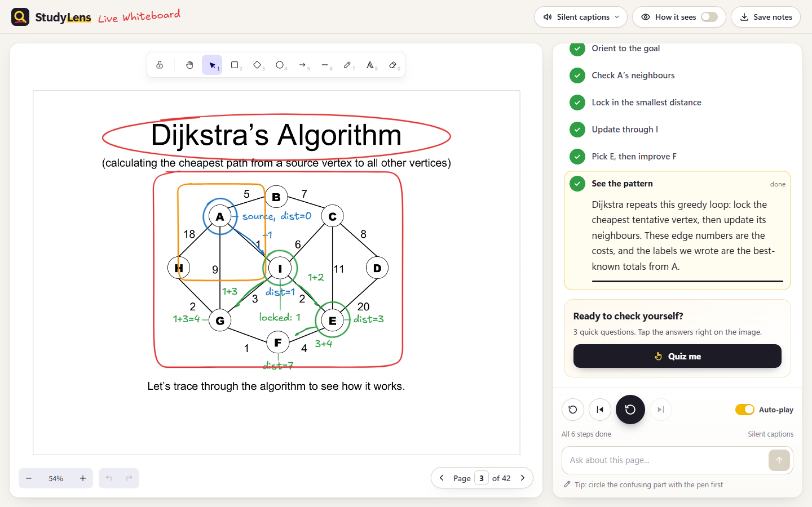
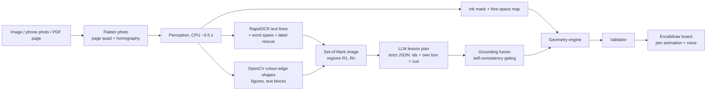
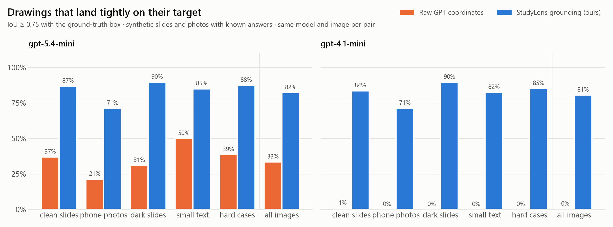
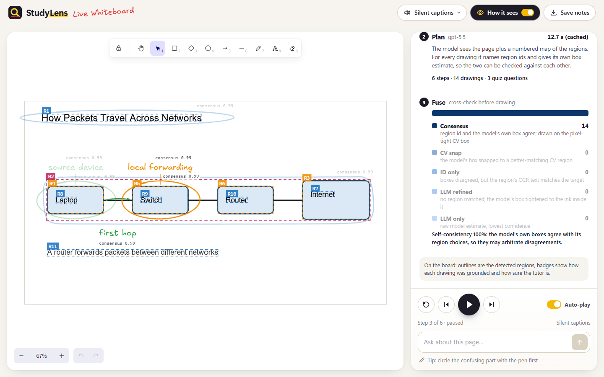
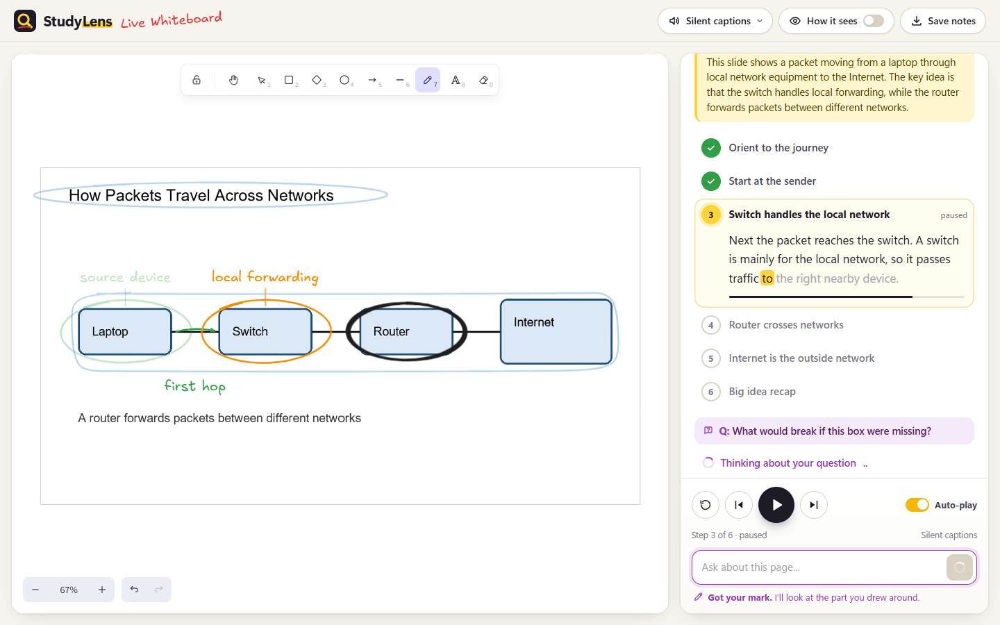

# StudyLens Live Whiteboard

**An AI tutor that teaches any slide, textbook photo or diagram by drawing on it.** Upload a page
(an image, a phone photo or a PDF lecture) and StudyLens explains it step by step, like a teacher at
a whiteboard: it circles the router, underlines the one word that matters, draws the arrow from cause
to effect and writes the intermediate values of an algorithm next to the nodes, all on top of your
untouched page, while it talks. Ask a follow-up (circle the confusing part with the pen) and it draws
again; finish with a quiz where you answer by tapping the image.

> Built for **Banana Hacks 2026** (image AI). Demo video: _link coming_.



## The problem with "AI draws on the screen"

Ask a vision model for coordinates and you get drawings that are *almost* right: circles a little off
target, labels sitting on top of the text, arrows that start in empty space. We measured it: on 407
targets in 24 slides, raw GPT coordinates land tightly on their target (IoU >= 0.75) only **34%** of
the time with gpt-5.4-mini and **0%** with gpt-4.1-mini. A tutor that circles the wrong thing is worse
than no drawing at all.

StudyLens never lets the language model draw. It borrows the idea behind Excalidraw's AI features:
the model produces a **symbolic plan** and deterministic code produces the geometry.

| Layer | Decides | Done by |
|---|---|---|
| What | which thing to point at, why, when in the narration | LLM (gpt-5.5) choosing **region ids** + a cue phrase |
| Where | pixel-exact boxes, down to one word | computer vision: OCR + OpenCV |
| Check | is this the right thing? how sure are we? | grounding fusion with self-consistency gating |
| How | ellipse padding, arrows on box edges, labels in free space | geometry engine |
| Draw | marker strokes, handwriting, timing | Excalidraw board synced to ElevenLabs word timestamps |

## Pipeline



**Perception (no LLM).**
- *Photo flattening:* a phone photo of a page is detected (tilted paper quadrilateral that differs from
  its surroundings) and warped flat, so OCR reads straight lines and the student sees a clean scan.
- *Text:* RapidOCR (PP-OCRv4, ONNX on CPU). Each line is re-binarised against its own background to
  get a tight box, restore dropped spaces and find **word-level spans** (so the tutor can underline
  "router" inside a sentence).
- *Label rescue:* the detector proposes text *lines* and misses lone labels such as graph edge weights
  or node letters. Character-sized ink blobs that no line covers are grouped and read by the
  recognizer alone (one batched call, ~0.2 s); on the Dijkstra slide this recovers all 14 edge weights.
- *Shapes:* closed outlines are found as **holes of a colour-edge map** (Canny on L, a and b), so boxes
  joined by connector lines still come out one by one, filled discs work as well as outlined boxes,
  and nested parts (cell > nucleus > nucleolus) each get a region. The outline thickness is measured
  outward from each hole so boxes hug the outer edge. Empty "pockets" enclosed by graph edges are
  rejected (their border cuts through other shapes).
- *Figures, text blocks, free space:* remaining ink becomes figures (icons, arrows, chart parts); lines
  are grouped into blocks; an integral image over the ink mask places labels where the page is empty.

**Planning.** The LLM sees the original page and the Set-of-Mark page (every region outlined with its
id), plus a region list with text and a coarse position but **no coordinates**. For every drawing it
returns the region ids *and* its own independent box estimate, a cue phrase from the narration (the
drawing appears when that phrase is spoken) and, for algorithms or worked examples, the intermediate
values to write on the board ("1 + 3 = 4").

**Grounding fusion.** Two independent signals are cross-checked per target:
- agreement between the chosen regions and the model's own estimate gives a **consensus** (CV box used);
- disagreement is arbitrated: snap to the region the estimate really covers, keep ids whose text
  matches, or tighten the estimate to the ink inside it;
- **label promotion:** "the Router" means the Router *box*, not the word inside it (unless the
  description asks for the words, or the drawing is an underline);
- **self-consistency gating:** how much a response's box estimates can be trusted is measured from the
  response itself (share of targets where estimate and ids agree). gpt-5.5 agrees with itself ~100% of
  the time, gpt-4.1-mini rarely; low agreement switches arbitration off so a guessing model cannot
  drag correct regions off target. This one rule lifted gpt-4.1-mini from 63% to 81% tight hits.

**Geometry and validation.** Ellipses are padded to clear the target's corners, arrows start and end on
box edges and bend toward empty space, underlines follow word spans, labels are sized from the page's
own text and placed off printed text and earlier drawings. A validator fixes cues, ids, counts and
drops anything without usable geometry, recording every fix.

## Results

`backend/scripts/eval_grounding.py` locates **407 ground-truth targets in 24 images** (synthetic
lecture slides with known answers in clean, phone-photo, dark and small-text variants, plus hard cases)
four ways from the **same model calls**, and scores IoU with the true box.



| model | method | mean IoU | hit@0.5 | hit@0.75 | hit@0.9 |
|---|---|---|---|---|---|
| gpt-5.4-mini | raw GPT coordinates | 0.59 | 65% | 34% | 15% |
| gpt-5.4-mini | model's estimate with region marks | 0.55 | 62% | 31% | 11% |
| gpt-5.4-mini | chosen region ids only | 0.77 | 82% | 77% | 65% |
| gpt-5.4-mini | **StudyLens fusion** | **0.83** | **89%** | **83%** | **69%** |
| gpt-4.1-mini | raw GPT coordinates | 0.11 | 5% | 0% | 0% |
| gpt-4.1-mini | chosen region ids only | 0.79 | 84% | 79% | 66% |
| gpt-4.1-mini | **StudyLens fusion** | **0.81** | **86%** | **81%** | **68%** |

What this shows, and what it does not:
- With grounding, an older, cheap model draws as precisely as the newest one; raw coordinates from
  either are not good enough to draw with on real diagrams.
- On a single clean, sparse slide, gpt-5.4-mini's raw boxes are excellent (0.95 IoU in our first
  probe); the gap opens on dense diagrams, photos and small text.
- Photo flattening is shipped as a feature, not claimed as an accuracy gain: our photo ground truth is
  the bounding box of each warped shape, which penalises tight boxes after flattening
  (`samples/eval/results_flatten.md` has that run).
- Full tables: [`samples/eval/results.md`](samples/eval/results.md).

## Features

| How it sees: regions, grounding, confidence | Follow-up: circle it and ask |
|---|---|
|  |  |

- **Teach me this:** 4-8 narrated steps; each drawing appears when its cue phrase is spoken.
- **Follow-up questions:** circle the confusing part with the pen and ask; answers are drawn in purple.
- **Tap quiz:** "Tap the device that forwards packets" checked against the grounded box.
- **How it sees:** the Set-of-Mark regions, each drawing's grounding type and confidence, timings.
- **PDF lectures:** upload a PDF and pick a page.
- **Save notes:** export the annotated page as a PNG.

## Run it locally

Requirements: Python 3.12, Node 20+, an OpenAI API key, optionally an ElevenLabs key.

```bash
# .env in the repo root
OPENAI_API_KEY=...
ELEVENLABS_API_KEY=...        # optional: browser voice is used without it

cd backend
python -m venv .venv && .venv/Scripts/python -m pip install -r requirements.txt   # (bin/ on macOS/Linux)
.venv/Scripts/python -m uvicorn app.main:app --port 8000

cd ../frontend
npm install && npm run dev     # http://localhost:5173 (proxies /api to :8000)
```

Command-line tools (from `backend/`):

```bash
python scripts/run_pipeline.py path/to/slide.png     # perception + lesson + preview PNGs
python scripts/perceive_debug.py path/to/slide.png   # Set-of-Mark image + regions vs ground truth
python scripts/eval_grounding.py                     # the evaluation above (responses are cached)
python -m pytest                                     # 50 tests, no network
```

## Repository

```
backend/app/perception/   rectify, preprocess (ink), ocr, textspan, rescue, regions, freespace, som, pipeline
backend/app/tutor/        prompts, llm, planner, grounding (fusion), geometry, validator
backend/app/tts/          ElevenLabs with word timestamps, disk cache
backend/app/main.py       FastAPI API
backend/scripts/          run_pipeline, perceive_debug, make_samples, eval_grounding, plot_eval
frontend/src/board/       Excalidraw board engine: pen strokes, overlays, quiz taps
frontend/src/             app shell, lesson player, voice sync, follow-ups, quiz
samples/                  synthetic slides with ground truth, evaluation results
CONTRACT.md               data contract and API
```

## Built with

OpenAI gpt-5.5 / gpt-5.4-mini (planning), RapidOCR (PP-OCRv4 ONNX), OpenCV, NumPy, Pillow,
PyMuPDF, FastAPI, ElevenLabs (voice with timestamps), React, Vite and
[Excalidraw](https://github.com/excalidraw/excalidraw) (MIT), whose hand-drawn rendering and
"model plans, code draws" approach to AI drawing inspired the board.
