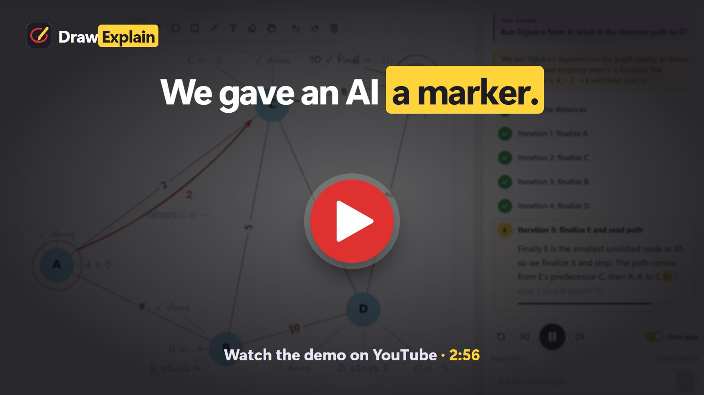
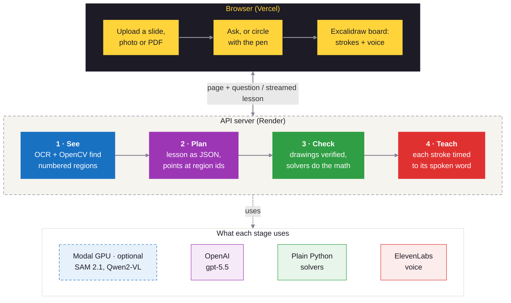

# DrawExplain

An AI tutor that teaches any study page by drawing on it. Upload a lecture slide, a phone photo of a
textbook or a PDF, ask a question (or just press Explain), and DrawExplain explains the page step by
step: it circles the right parts, writes the working next to them and talks you through it, like a
teacher at a whiteboard.

- Live app: https://drawexplain.vercel.app
- Demo video: https://youtu.be/zywVs08X2wk
- Code: https://github.com/AuvroIslam/DrawExplain
- Built for Banana Hacks 2026 (image AI). Write-up: [docs/WRITEUP.md](docs/WRITEUP.md)

<p align="center">
  <a href="https://youtu.be/zywVs08X2wk"></a>
</p>


## The problem

When a slide does not make sense, a chatbot answers with a wall of text that never points at anything.
And when an AI tries to draw on the page itself, its coordinates are almost right: circles miss the
node, labels cover the text. We measured it: raw GPT boxes land tightly on their target only 34% of the
time. On algorithm slides, models also take shortcuts: asked about Dijkstra, plain prompting never ran
the algorithm correctly (0 of 3 runs).

## Our solution


DrawExplain splits the job so each part does what it is good at:

1. **See (computer vision).** OCR reads every line and label, OpenCV finds shapes, and on the optional GPU
   service SAM 2.1 sharpens unsure shapes and a vision model reads formulas as LaTeX. Every element on
   the page becomes a numbered region.
2. **Plan (language model).** gpt-5.5 plans the lesson by naming regions ("circle R7"), never pixel
   coordinates, and says when in the narration each drawing appears.
3. **Check (code).** Each drawing is cross-checked against the region it names. When the page shows an
   algorithm (graph search, spanning trees, sorting, binary search, TCP congestion control, CPU
   scheduling, page replacement), the model only reads the data off the page, the pixels confirm it,
   and code runs the algorithm. The numbers on the board come from code.
4. **Teach (whiteboard and voice).** Marker strokes are drawn on the untouched page in sync with an
   ElevenLabs voice. You can circle a part and ask a follow-up, then take a quiz by tapping the image.

## System architecture


```mermaid
flowchart TB
    subgraph WEB["Browser (Vercel)"]
        direction LR
        B1["Upload a slide,<br/>photo or PDF"]:::board --> B2["Ask, or circle<br/>with the pen"]:::board --> B3["Excalidraw board:<br/>strokes + voice"]:::board
    end

    subgraph API["API server (Render)"]
        direction LR
        S["<b>1 · See</b><br/>OCR + OpenCV find<br/>numbered regions"]:::see --> P["<b>2 · Plan</b><br/>lesson as JSON,<br/>points at region ids"]:::plan --> C["<b>3 · Check</b><br/>drawings verified,<br/>solvers do the math"]:::check --> T["<b>4 · Teach</b><br/>each stroke timed<br/>to its spoken word"]:::teach
    end

    subgraph SVC["What each stage uses"]
        direction LR
        GPU["Modal GPU · optional<br/>SAM 2.1, Qwen2-VL"]:::see2 ~~~ LLM["OpenAI<br/>gpt-5.5"]:::plan2 ~~~ PY["Plain Python<br/>solvers"]:::check2 ~~~ EL["ElevenLabs<br/>voice"]:::teach2
    end

    WEB <== "page + question / streamed lesson" ==> API
    API -. "uses" .-> SVC

    classDef board fill:#ffd43b,stroke:#1d1b26,color:#1d1b26
    classDef see fill:#1971c2,stroke:#1971c2,color:#ffffff
    classDef plan fill:#9c36b5,stroke:#9c36b5,color:#ffffff
    classDef check fill:#2f9e44,stroke:#2f9e44,color:#ffffff
    classDef teach fill:#e03131,stroke:#e03131,color:#ffffff
    classDef see2 fill:#e7f1fb,stroke:#1971c2,color:#1d1b26,stroke-dasharray:5 4
    classDef plan2 fill:#f6eaf9,stroke:#9c36b5,color:#1d1b26
    classDef check2 fill:#e8f5ea,stroke:#2f9e44,color:#1d1b26
    classDef teach2 fill:#fdecec,stroke:#e03131,color:#1d1b26
    style WEB fill:#1d1b26,stroke:#1d1b26,color:#ffd43b
    style API fill:#f6f4ef,stroke:#8a8696,color:#1d1b26,stroke-dasharray:6 4
    style SVC fill:#ffffff,stroke:#e2ddd1,color:#1d1b26
    linkStyle 0,1,2,3,4,8,9 stroke:#8a8696,stroke-width:2px
```

## Why it works


| What we measured | Before | DrawExplain |
|---|---|---|
| Drawings that land tightly on their target (407 targets, 24 images) | 34% (raw GPT boxes) | 83% |
| Fully correct lessons on hard algorithm pages (3 pages, 3 runs each) | 3 of 9 (prompting only) | 9 of 9 |
| Fact-check score on 20 real study pages (core + 17 Wikimedia Commons pages) | 0.86 (prompt rules) | 0.93 |

The numbers come from the evaluation scripts in `backend/scripts/` (`eval_grounding.py` for drawing
placement, `eval_lessons.py` for lesson quality), run on the benchmark pages in `samples/bench/`. Lesson
scores are automatic fact checks on real lessons; every failed check was read by hand.

## How we built it: inspiration and design process

**Inspiration.** A teacher explains a slide by walking to the board and drawing on it. Chatbots only
write. We wanted an AI that points at the exact part of your page while it talks.

**Design process.** We measured every step and changed course when a number said so:

1. **Can the model draw by itself?** On a clean slide the newest models place boxes well, but on dense
   diagrams, photos and small text their circles miss: only 34% of 407 targets land tightly.
2. **Vision first.** OCR, a rescue pass for lone labels like graph weights, and OpenCV shapes turn the
   page into numbered regions. The model names regions, and its own box is a second opinion, gated by
   how self-consistent its answer is (63% to 81% tight hits for a small model).
3. **Code does the math.** Prompt rules alone still skipped Dijkstra relaxations, so the model now only
   reads the problem off the page and solvers run it: fully correct algorithm lessons went from 3/9 to 9/9.
4. **Test on real pages.** 17 Wikimedia Commons pages exposed CPU scheduling and page replacement
   mistakes, so we added solvers for both.
5. **GPU where it helps.** SAM 2.1 on Modal lifts the uncertain targets from 26% to 47% tight hits, and
   Qwen2-VL reads formulas as LaTeX.
6. **User testing.** A misread geometry figure led to colour-aware region descriptions and a "read the
   page, not the textbook version" rule.

## Screenshots


## Features

- Explain with or without your own question; every drawing appears when the voice mentions it.
- Algorithms and procedures are run on the page's own example, with every changed value on the board.
- PDF reader mode: turn pages freely; only the page you ask about is scanned, and earlier pages give context.
- Follow-up questions: circle the confusing part with the pen and ask.
- Tap quiz, "How it sees" view of the regions and timings, and Save notes as a PNG.
- Ten example pages to try, from Dijkstra and CPU scheduling to circuits and the Calvin cycle.

## Run it locally

Requirements: Python 3.12, Node 20+, an OpenAI API key. An ElevenLabs key is optional (the browser
voice is used without it), and so is the GPU service.

```bash
# .env in the repo root
OPENAI_API_KEY=...
ELEVENLABS_API_KEY=...        # optional
GPU_URL=...                   # optional, see backend/gpu/modal_app.py
GPU_KEY=...

cd backend
python -m venv .venv
.venv/Scripts/python -m pip install -r requirements.txt      # bin/ instead of Scripts/ on macOS and Linux
.venv/Scripts/python -m uvicorn app.main:app --port 8000

cd ../frontend
npm install
npm run dev                   # http://localhost:5173
```

Tests: `cd backend && .venv/Scripts/python -m pytest` (89 tests, no network).

Deployment: the API runs from the root `Dockerfile` on Render (`render.yaml`), the frontend on Vercel
with `VITE_API_BASE` pointing at the API.

## Project structure

```
backend/app/perception/   OCR, shapes, label rescue, photo flattening, free space, GPU client
backend/app/tutor/        prompts, lesson planner, grounding, geometry, validator
backend/app/tutor/solvers/  reads algorithm data off the page, checks it, runs the algorithm
backend/gpu/              GPU service on Modal (SAM 2.1, formula OCR)
backend/scripts/          evaluation scripts (grounding, lessons, formula OCR)
frontend/src/             React app and the Excalidraw whiteboard engine
samples/                  example pages, benchmark cases and evaluation results
docs/                     results log, write-up, demo script, graphics
```

## Resources and credits

**Generative AI tools we used**

| Tool | Used for |
|---|---|
| OpenAI gpt-5.5 | In the app: plans each lesson and reads algorithm data off the page. Other OpenAI models (gpt-4.1, gpt-5-mini, gpt-5.4) were compared in our evaluations. |
| ElevenLabs text-to-speech | In the app: the tutor voice, with word timestamps that time the drawings. |
| ElevenLabs voice, music and sound effects | The demo video's narration, music and sound effects. |
| Claude Code (Anthropic) | Development: writing and testing the code, running the evaluations, and preparing the docs, graphics and demo video. |

**Pre-trained models**

| Model | Source | License |
|---|---|---|
| PP-OCRv4 text detection and recognition, via RapidOCR | PaddleOCR / RapidAI | Apache-2.0 |
| SAM 2.1 base+ (optional GPU service), via Ultralytics | Meta AI | Apache-2.0 (Ultralytics: AGPL-3.0) |
| Qwen2-VL-2B-Instruct (optional GPU service, formula OCR) | Alibaba Qwen | Apache-2.0 |

**Open-source libraries**

- Backend: FastAPI, Uvicorn, Pydantic, OpenCV, NumPy, Pillow, PyMuPDF, RapidOCR (ONNX Runtime), httpx,
  OpenAI Python SDK.
- GPU service: PyTorch, Hugging Face Transformers, Ultralytics, Modal.
- Frontend: React, Vite, Excalidraw, mermaid-to-excalidraw, Rough.js, lucide-react.
- Tooling: pytest, Playwright (screenshots and screen recording), ffmpeg (demo video).

**Data**

- Benchmark pages from Wikimedia Commons. Every image's source, author and license is in
  [samples/bench/SOURCES.md](samples/bench/SOURCES.md).
- Synthetic test slides that we generated ourselves (`samples/synthetic/`).

**Hosting:** Vercel (frontend), Render (API), Modal (GPU service).


